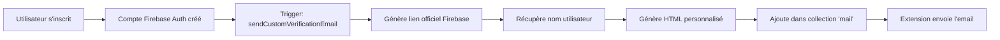
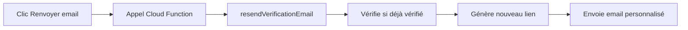

# Système d'Email de Vérification Personnalisé - VenteMoi

## 🎯 Objectif
Remplacer les emails de vérification standard de Firebase par des emails personnalisés aux couleurs de VenteMoi, tout en conservant le lien de vérification officiel et sécurisé de Firebase.

## 📁 Fichiers Créés

### 1. `functions/email-verification.js`
Contient les Cloud Functions pour :
- **sendCustomVerificationEmail** : Déclenché automatiquement lors de la création d'un utilisateur
- **resendVerificationEmail** : Fonction callable pour renvoyer l'email
- **testVerificationEmail** : Endpoint HTTP pour tester le template

### 2. `functions/deploy-email-verification.sh`
Script de déploiement automatique des fonctions

## 🚀 Installation et Déploiement

### Prérequis
- Node.js 18+
- Firebase CLI installé (`npm install -g firebase-tools`)
- Projet Firebase configuré (Blaze plan requis)
- Extension "Trigger Email" installée et configurée

### Étapes de Déploiement

1. **Naviguer vers le dossier functions**
```bash
cd functions
```

2. **Exécuter le script de déploiement**
```bash
./deploy-email-verification.sh
```

Ou manuellement :
```bash
npm install
firebase deploy --only functions:sendCustomVerificationEmail,functions:resendVerificationEmail,functions:testVerificationEmail
```

## ⚙️ Configuration Firebase Console

### 1. Désactiver les Emails par Défaut

**IMPORTANT** : Pour éviter les doublons, désactivez l'envoi automatique de Firebase

1. Aller dans [Firebase Console](https://console.firebase.google.com)
2. **Authentication** > **Templates**
3. **Email de vérification** :
   - ❌ Décocher "Envoyer automatiquement un email de vérification"

### 2. Vérifier l'Extension Email

L'extension "Trigger Email" doit être configurée pour envoyer les emails via la collection `mail`.

1. **Extensions** > **Trigger Email**
2. Vérifier la configuration :
   - Collection : `mail`
   - Service SMTP configuré

## 🔄 Flux de Fonctionnement

### Création de Compte


### Renvoi d'Email


## 🎨 Template Email

Le template inclut :
- ✅ Header avec logo VenteMoi
- ✅ Couleurs de la charte graphique (#f8b02a)
- ✅ Design responsive
- ✅ Bouton CTA proéminent
- ✅ Lien de fallback en texte
- ✅ Footer avec informations de contact

## 🧪 Tests

### 1. Tester le Template HTML
```bash
# Visualiser le template dans un navigateur
curl "https://europe-west1-ventemoi.cloudfunctions.net/testVerificationEmail?email=test@example.com&name=Pierre&secret=ventemoi2024" > test-email.html
open test-email.html
```

### 2. Tester la Création de Compte
1. Créer un nouveau compte dans l'app
2. Vérifier dans Firestore : `email_logs` collection
3. Vérifier dans Firestore : `mail` collection (status: 'sent')
4. Vérifier la réception de l'email

### 3. Tester le Renvoi
1. Se connecter avec un compte non vérifié
2. Cliquer sur "Renvoyer l'email"
3. Vérifier les logs : `firebase functions:log`

## 📊 Monitoring

### Logs en Temps Réel
```bash
# Tous les logs des fonctions email
firebase functions:log --only sendCustomVerificationEmail,resendVerificationEmail

# Derniers 50 logs
firebase functions:log -n 50
```

### Collections Firestore à Surveiller
- **`mail`** : Emails envoyés (status: pending → sent)
- **`email_logs`** : Historique des envois
- **`email_errors`** : Erreurs d'envoi

## 🐛 Dépannage

### Email non reçu
1. Vérifier dans les **spams**
2. Vérifier la collection `mail` dans Firestore
3. Vérifier les logs : `firebase functions:log`
4. Vérifier l'extension Email est bien configurée

### Erreur "requires-recent-login"
Normal si l'utilisateur essaie après un certain temps. Le système de fallback prendra le relais.

### Double email reçu
Vérifiez que l'envoi automatique Firebase est bien désactivé dans Authentication > Templates

## 🔒 Sécurité

- ✅ Lien de vérification généré côté serveur uniquement
- ✅ Expire après 24 heures
- ✅ Fonction callable protégée par authentification
- ✅ Logs d'erreurs pour audit
- ✅ Fallback sur méthode standard si problème

## 📝 Modifications Flutter

### register_screen_controller.dart
```dart
// AVANT :
await user.sendEmailVerification();

// APRÈS :
// Rien ! La Cloud Function s'en charge automatiquement
```

### login_screen_controller.dart
```dart
// Pour renvoyer l'email :
final callable = FirebaseFunctions.instanceFor(region: 'europe-west1')
    .httpsCallable('resendVerificationEmail');
await callable.call();
```

## 🎯 Résultat Final

Les utilisateurs reçoivent maintenant :
- **UN SEUL** email de vérification
- Avec le **design VenteMoi**
- Contenant le **lien officiel Firebase**
- **100% fonctionnel** et sécurisé
- **Personnalisé** avec leur nom

## 📞 Support

En cas de problème :
1. Vérifier les logs Cloud Functions
2. Vérifier la collection `email_errors` dans Firestore
3. Contacter l'équipe technique

---

*Documentation créée le 29/09/2025 pour VenteMoi*